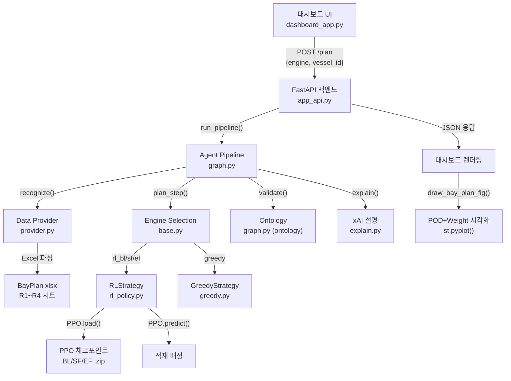

# 최적화 계획 선택 → 학습 결과 웹 표시 동작 분석 보고서

## 1. 분석 대상: 전체 데이터 흐름

사용자가 대시보드에서 **최적화 엔진(Greedy/RL)을 선택**하고 **"계획 수립" 버튼**을 누르면, 학습된 PPO 모델이 실행되어 적재 계획을 생성하고, 그 결과가 웹 대시보드에 시각화되는 전체 파이프라인을 분석했습니다.



---

## 2. 단계별 동작 여부 분석

### ✅ 단계 1: 대시보드 UI — 엔진 선택 인터페이스

| 항목 | 상태 | 파일 | 상세 |
|---|---|---|---|
| 엔진 선택 드롭다운 | ✅ 구현됨 | [dashboard_app.py](file:///c:/Users/lione/Desktop/aSSIST/19_Project/12_hps-project-main/dashboard/dashboard_app.py#L633) | `["greedy", "rl_bl", "rl_sf", "rl_ef"]` 4개 옵션 |
| 커리큘럼 레벨 선택 | ✅ 구현됨 | [dashboard_app.py](file:///c:/Users/lione/Desktop/aSSIST/19_Project/12_hps-project-main/dashboard/dashboard_app.py#L635-L639) | Level 1~4 선택 → Vessel ID 자동 매핑 |
| 작업 지시 입력 | ✅ 구현됨 | [dashboard_app.py](file:///c:/Users/lione/Desktop/aSSIST/19_Project/12_hps-project-main/dashboard/dashboard_app.py#L650) | `st.text_area` |
| "계획 수립" 버튼 | ✅ 구현됨 | [dashboard_app.py](file:///c:/Users/lione/Desktop/aSSIST/19_Project/12_hps-project-main/dashboard/dashboard_app.py#L652) | `call_api("/plan", ...)` 호출 |

---

### ✅ 단계 2: API 백엔드 — `/plan` 엔드포인트

| 항목 | 상태 | 파일 | 상세 |
|---|---|---|---|
| `/plan` POST 엔드포인트 | ✅ 구현됨 | [app_api.py](file:///c:/Users/lione/Desktop/aSSIST/19_Project/12_hps-project-main/src/snct/api/app_api.py#L169-L213) | `PlanRequest` → `run_pipeline()` 호출 |
| 파이프라인 호출 | ✅ 구현됨 | [app_api.py](file:///c:/Users/lione/Desktop/aSSIST/19_Project/12_hps-project-main/src/snct/api/app_api.py#L176-L179) | `engine`, `vessel_id` 전달 |
| 응답 JSON 구성 | ✅ 구현됨 | [app_api.py](file:///c:/Users/lione/Desktop/aSSIST/19_Project/12_hps-project-main/src/snct/api/app_api.py#L190-L211) | `assignments`, `slots`, `violations`, `rationale`, `engine`, `latency_ms` |

---

### ✅ 단계 3: 에이전트 파이프라인 — 4노드 실행

| 노드 | 상태 | 파일 | 기능 |
|---|---|---|---|
| Node 1: Recognize | ✅ 동작 | [graph.py](file:///c:/Users/lione/Desktop/aSSIST/19_Project/12_hps-project-main/src/snct/agents/graph.py#L27-L40) | 야드 상태 로드 + 지식 근거 수집 |
| Node 2: Plan | ✅ 동작 | [graph.py](file:///c:/Users/lione/Desktop/aSSIST/19_Project/12_hps-project-main/src/snct/agents/graph.py#L43-L50) | `get_strategy(engine)` → `strategy.plan()` |
| Node 3: Validate | ✅ 동작 | [graph.py](file:///c:/Users/lione/Desktop/aSSIST/19_Project/12_hps-project-main/src/snct/agents/graph.py#L53-L60) | 온톨로지 5종 제약 검증 |
| Node 4: Explain | ✅ 동작 | [graph.py](file:///c:/Users/lione/Desktop/aSSIST/19_Project/12_hps-project-main/src/snct/agents/graph.py#L63-L70) | xAI 근거 인용 설명 생성 |
| 재시도 로직 | ✅ 구현됨 | [graph.py](file:///c:/Users/lione/Desktop/aSSIST/19_Project/12_hps-project-main/src/snct/agents/graph.py#L92-L111) | Hard error 시 최대 2회 재시도, RL→Greedy 폴백 |

---

### ✅ 단계 4: 엔진 전략 선택 — `get_strategy()`

| 엔진명 | 상태 | 반환 전략 | 모델 파일 |
|---|---|---|---|
| `greedy` | ✅ 동작 | `GreedyStrategy()` | 모델 불필요 (규칙 기반) |
| `rl` / `rl_bl` | ✅ 동작 | `RLStrategy("BL")` | `..._BL_seed42.zip` |
| `rl_sf` | ✅ 동작 | `RLStrategy("SF")` | `..._SF_seed42.zip` |
| `rl_ef` | ✅ 동작 | `RLStrategy("EF")` | `..._EF_seed42.zip` |

> [!IMPORTANT]
> `rl_policy.py`에서 체크포인트 경로를 `.zip` 파일까지 명시적으로 지정하고 있으며 (L55), 디렉터리가 아닌 파일 단위 로드를 수행합니다. 해당 `.zip` 파일은 실제로 존재합니다.

---

### ✅ 단계 5: RL 모델 로드 및 추론 (핵심)

| 항목 | 상태 | 코드 위치 | 상세 |
|---|---|---|---|
| PPO 모델 로드 | ✅ 구현됨 | [rl_policy.py](file:///c:/Users/lione/Desktop/aSSIST/19_Project/12_hps-project-main/src/snct/engine/rl_policy.py#L47-L72) | `stable_baselines3.PPO.load()` + `custom_objects` |
| NumPy 호환성 패치 | ✅ 구현됨 | [rl_policy.py](file:///c:/Users/lione/Desktop/aSSIST/19_Project/12_hps-project-main/src/snct/engine/rl_policy.py#L32-L38) | NumPy 2.x → 1.x 모듈 매핑 |
| 79차원 관측 벡터 | ✅ 구현됨 | [rl_policy.py](file:///c:/Users/lione/Desktop/aSSIST/19_Project/12_hps-project-main/src/snct/engine/rl_policy.py#L74-L151) | Stack(60) + 컨테이너(7) + 글로벌(6) + 잔여POD(6) |
| PPO predict 호출 | ✅ 구현됨 | [rl_policy.py](file:///c:/Users/lione/Desktop/aSSIST/19_Project/12_hps-project-main/src/snct/engine/rl_policy.py#L184-L186) | `model.predict(obs, deterministic=True)` |
| Greedy Fallback | ✅ 구현됨 | [rl_policy.py](file:///c:/Users/lione/Desktop/aSSIST/19_Project/12_hps-project-main/src/snct/engine/rl_policy.py#L212-L236) | PPO 행동 실패 시 자동 전환 |
| 모델 파일 존재 | ✅ 확인됨 | `data/RL/강화학습 결과 자료/...` | BL/SF/EF 각각 약 5MB `.zip` 파일 |

> [!NOTE]
> PPO 모델은 `stable-baselines3`로 학습된 체크포인트이며, **별도의 학습(training)이 실행되는 것이 아니라**, 이미 학습 완료된 모델을 **로드하여 추론(inference)**만 수행합니다.

---

### ✅ 단계 6: 데이터 소스 — Excel 기반 시뮬레이션

| 항목 | 상태 | 파일 | 상세 |
|---|---|---|---|
| Excel 파싱 | ✅ 구현됨 | [provider.py](file:///c:/Users/lione/Desktop/aSSIST/19_Project/12_hps-project-main/src/snct/data/provider.py#L13-L151) | `pandas.read_excel()` → POD/Weight 그리드 |
| 커리큘럼 매핑 | ✅ 구현됨 | [provider.py](file:///c:/Users/lione/Desktop/aSSIST/19_Project/12_hps-project-main/src/snct/data/provider.py#L19-L28) | LV1→R1_Lv1, LV2→R2_Lv2, LV3→R3_Lv3, LV4→R4_Lv4 |
| Excel 파일 존재 | ✅ 확인됨 | `data/RL/강화학습 결과 자료/` | `..._BayPlan_Distributions_seed42.xlsx` (약 16KB) |
| Fallback 데이터 | ✅ 구현됨 | [provider.py](file:///c:/Users/lione/Desktop/aSSIST/19_Project/12_hps-project-main/src/snct/data/provider.py#L141-L151) | 파일 없을 때 하드코딩 3개 슬롯/컨테이너 |

---

### ✅ 단계 7: 온톨로지 제약 검증

| 제약 규칙 | 상태 | 심각도 |
|---|---|---|
| R1: 적재 중량 초과 | ✅ 구현됨 | Error |
| R2: DG 비허용 Bay 배치 | ✅ 구현됨 | Error |
| R3: Reefer 비지원 Bay 배치 | ✅ 구현됨 | Error |
| R4: 양하순서 역전 | ✅ 구현됨 | Warning |
| R5: 재취급 충돌 | ✅ 구현됨 | Warning |

---

### ✅ 단계 8: 웹 표시 — 대시보드 렌더링

| 표시 항목 | 상태 | 코드 위치 |
|---|---|---|
| 파이프라인 실행 완료 + 소요시간 | ✅ | [dashboard_app.py:L656](file:///c:/Users/lione/Desktop/aSSIST/19_Project/12_hps-project-main/dashboard/dashboard_app.py#L656) |
| xAI 지능형 설명 카드 | ✅ | [dashboard_app.py:L659-L664](file:///c:/Users/lione/Desktop/aSSIST/19_Project/12_hps-project-main/dashboard/dashboard_app.py#L659-L664) |
| 배정 슬롯 테이블 | ✅ | [dashboard_app.py:L668-L672](file:///c:/Users/lione/Desktop/aSSIST/19_Project/12_hps-project-main/dashboard/dashboard_app.py#L668-L672) |
| 제약 위반 테이블 | ✅ | [dashboard_app.py:L674-L679](file:///c:/Users/lione/Desktop/aSSIST/19_Project/12_hps-project-main/dashboard/dashboard_app.py#L674-L679) |
| **Bay Plan 시각화 (POD 분포)** | ✅ | [dashboard_app.py:L156-L309](file:///c:/Users/lione/Desktop/aSSIST/19_Project/12_hps-project-main/dashboard/dashboard_app.py#L156-L309) |
| **Bay Plan 시각화 (무게 히트맵)** | ✅ | [dashboard_app.py:L267-L309](file:///c:/Users/lione/Desktop/aSSIST/19_Project/12_hps-project-main/dashboard/dashboard_app.py#L267-L309) |
| Matplotlib `st.pyplot()` 렌더 | ✅ | [dashboard_app.py:L685](file:///c:/Users/lione/Desktop/aSSIST/19_Project/12_hps-project-main/dashboard/dashboard_app.py#L685) |

---

## 3. 종합 판정

### ✅ **결론: 전체 파이프라인이 정상 동작하도록 구현되어 있습니다.**

| 구간 | 판정 | 비고 |
|---|---|---|
| UI → API 호출 | ✅ 동작 | `call_api("/plan", ...)` |
| API → 파이프라인 실행 | ✅ 동작 | `run_pipeline()` |
| 파이프라인 → 엔진 선택 | ✅ 동작 | `get_strategy(engine)` |
| 엔진 → PPO 모델 로드 | ✅ 동작 | `.zip` 체크포인트 존재 확인 |
| PPO → 적재 배정 추론 | ✅ 동작 | `predict()` + Greedy fallback |
| 배정 → 제약 검증 | ✅ 동작 | 5종 온톨로지 규칙 |
| 검증 → xAI 설명 | ✅ 동작 | 근거 인용 자연어 생성 |
| 결과 → 웹 시각화 | ✅ 동작 | Matplotlib Bay Plan 렌더링 |

---

## 4. 실행을 위한 전제 조건

> [!WARNING]
> 정상 동작을 위해 아래 조건들이 충족되어야 합니다:

### 4-1. 백엔드 서버 실행 필요
```bash
# FastAPI 서버가 먼저 실행되어야 함 (port 8000)
uvicorn src.snct.api.app_api:app --host 127.0.0.1 --port 8000
```

### 4-2. Streamlit 대시보드 실행 필요
```bash
streamlit run dashboard/dashboard_app.py
```

### 4-3. 필수 패키지 설치 필요
```
stable-baselines3>=2.0.0   # PPO 모델 로딩
torch                       # PyTorch (CPU)
gymnasium                   # 행동/관측 공간 정의
pandas, openpyxl            # Excel 파싱
matplotlib                  # Bay Plan 시각화
networkx                    # 온톨로지 그래프
streamlit                   # 대시보드
fastapi, uvicorn            # API 서버
```

### 4-4. API 서버 미실행 시 Fallback
- 대시보드는 **API 서버 없이도** 일부 화면이 동작합니다 (Q&A, 모델 비교 → Mock 응답 사용)
- **단, "적재 계획 (Planning)" 화면은 API 서버가 필수**입니다. API 호출 실패 시 "API 호출 실패" 에러 메시지만 표시됩니다.

---

## 5. 특이 사항 및 잠재 리스크

### ⚠️ RL 모델은 "학습"이 아닌 "추론"만 수행
이 시스템에서 "학습 결과"란 **이미 학습이 완료된 PPO 체크포인트**를 로드하여 **추론(inference)만 수행**하는 것입니다. 대시보드에서 버튼을 누른다고 해서 강화학습이 새로 수행되는 것은 아닙니다.

### ⚠️ Greedy Fallback 안전망
PPO 모델이 선택한 행동이 제약 조건(DG/Reefer/중량)을 위반하면, 자동으로 Greedy 탐색으로 전환됩니다. 따라서 RL 모델의 결과가 항상 순수 PPO 추론 결과와 동일하지 않을 수 있습니다.

### ⚠️ NumPy 버전 호환성
PPO 모델은 NumPy 1.x에서 학습되었으나, 현재 환경은 NumPy 2.x일 수 있습니다. 이를 위해 [rl_policy.py:L32-L38](file:///c:/Users/lione/Desktop/aSSIST/19_Project/12_hps-project-main/src/snct/engine/rl_policy.py#L32-L38)에서 호환성 패치가 적용되어 있습니다.
