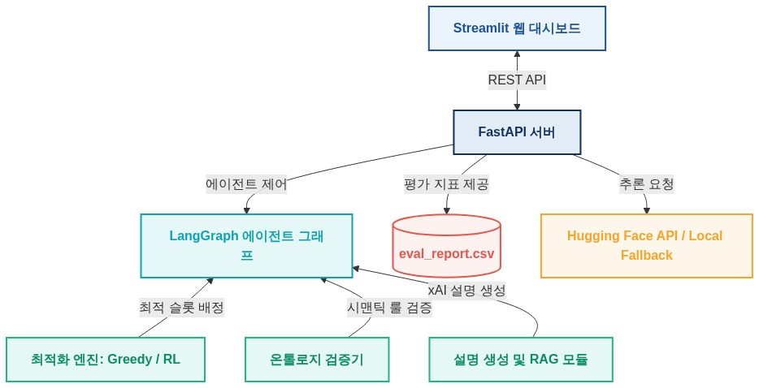
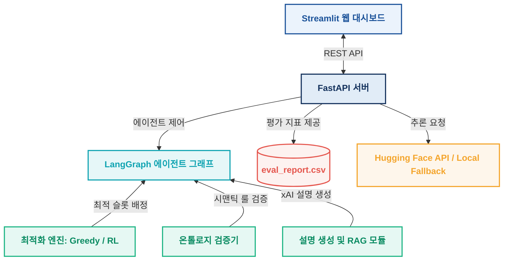

# PortSLM — 항만 도메인 특화 SLM 의사결정 지원 플랫폼 프로젝트 구조

이 문서는 인천신항 SNCT 컨테이너 터미널의 본선 적재 계획(Stowage Planning) 및 안전 규정(SOP) 질의응답을 지원하기 위해 설계된 **PortSLM** 프로젝트의 전체 디렉토리 및 소스코드 구조를 상세히 정리하고 설명합니다.

---

## 📂 전체 프로젝트 구조 개요

```text
12_hps-project-main/
│
├── .github/                      # CI/CD 및 Github 설정 파일
├── dashboard/                    # 프론트엔드 UI 컴포넌트
│   ├── app.py                    # 프론트엔드 와이어프레임용 앱
│   └── dashboard_app.py          # 메인 Streamlit 대시보드 애플리케이션
│
├── data/                         # 시뮬레이션 및 평가용 데이터 폴더
│   └── simulated/
│       ├── eval_golden.jsonl     # 평가용 골든 데이터셋 (30문항)
│       ├── eval_report.csv       # 베이스 vs 파인튜닝 모델 최종 평가 리포트
│       ├── train.jsonl / val.jsonl  # SLM 학습 및 검증용 JSONL 데이터
│       └── feedback_log.jsonl    # 사용자 평가 피드백 로그 파일
│
├── docs/                         # 기획서 및 부가 개발 문서
├── specs/                        # 상세 설계 규격 및 의사결정(ADR) 문서
│   ├── decisions/                # 아키텍처 의사결정 기록 (ADR)
│   ├── PRD.md                    # 제품 요구사항 문서 (Product Requirements Document)
│   └── architecture.md           # 전체 시스템 아키텍처 다이어그램 및 설계 명세
│
├── src/                          # 메인 백엔드 및 서비스 소스코드 폴더
│   └── snct/
│       ├── agents/               # LangGraph 기반 지능형 에이전트 그래프
│       ├── api/                  # FastAPI 기반 REST API 서버
│       ├── common/               # 프로젝트 공통 데이터 모델 및 유틸리티
│       ├── data/                 # 백엔드 내부 데이터 리포지토리/클라이언트
│       ├── engine/               # 적재 계획 최적화 코어 엔진 (Greedy, RL, CP-SAT)
│       ├── eval/                 # 모델 평가 및 벤치마킹 모듈
│       ├── knowledge/            # 설명 가능 지능(xAI) 및 RAG 모듈 (NL2SQL, DocRAG, GraphRAG)
│       ├── ontology/             # 지식 그래프 및 시맨틱 검증 모듈
│       └── slm/                  # 소형 언어 모델(SLM) 파인튜닝 및 머지/업로드 파이프라인
│
├── tests/                        # 단위 테스트 및 통합 테스트 코드
│   ├── test_api_plan.py          # API 최적화 적재 계획 호출 테스트
│   └── test_slm_pipeline.py      # 에이전트 파이프라인 통합 테스트
│
├── requirements.txt              # 전체 프로젝트 파이썬 의존성 패키지 목록
└── README.md                     # 프로젝트 실행 및 기본 설명서
```

---

## 🛠 주요 모듈 및 파일별 상세 설명

### 1. 프론트엔드 레이어 (`dashboard/`)
* **[dashboard_app.py](file:///C:/Users/lione/Desktop/aSSIST/19_Project/12_hps-project-main/dashboard/dashboard_app.py)**
  * 사용자가 시스템과 인터랙션하는 메인 화면인 **Streamlit 웹 대시보드**입니다.
  * 총 6가지 메뉴 화면을 제공합니다:
    1. **홈 (Home)**: 서비스 소개 및 모델 정보 카드, 예시 질문 칩 제공.
    2. **도메인 Q&A**: 자연어로 터미널 규칙 질의 시 백엔드를 통해 답변 및 근거 용어 출력, 인간 피드백(👍/👎) 전송 기능.
    3. **모델 비교 (前/後)**: 베이스 모델과 파인튜닝 모델의 출력값을 1:1로 비교 대조하여 보고 선호도 투표 수행.
    4. **평가 대시보드**: 골든셋 30문항에 대한 정량(ROUGE-L, 도메인 용어 포함률) 및 정성(LLM-as-judge) 성능 평가 그래프와 샘플별 상세 테이블 제공.
    5. **적재 계획 (Planning)**: 최적화 엔진(Greedy, RL)을 선택하고 선적 지시를 입력하여 슬롯 배정 결과, 제약 조건 위반 감지 결과, 지능형 설명을 렌더링.
    6. **이력 조회**: 전송된 질문 및 피드백 기록의 테이블 조회.

### 2. 최적화 및 에이전트 레이어 (`src/snct/`)

#### 2.1. 지능형 에이전트 오케스트레이터 (`src/snct/agents/`)
* **[graph.py](file:///C:/Users/lione/Desktop/aSSIST/19_Project/12_hps-project-main/src/snct/agents/graph.py)**
  * **LangGraph**를 활용하여 `인지(Recognize) ➔ 계획(Plan) ➔ 검증(Validate) ➔ 설명(Explain)`으로 이어지는 에이전트 제어 흐름을 설계 및 구현합니다.
  * 사용자의 지시사항을 판단하여 최적화 엔진을 선택적으로 태우고 제약 조건 검증 모듈을 결합합니다.

#### 2.2. 적재 최적화 엔진 (`src/snct/engine/`)
* **[greedy.py](file:///C:/Users/lione/Desktop/aSSIST/19_Project/12_hps-project-main/src/snct/engine/greedy.py)**: 규칙 기반 휴리스틱 탐색으로 동작하는 기본 그리디 적재 계획 엔진입니다.
* **[rl_policy.py](file:///C:/Users/lione/Desktop/aSSIST/19_Project/12_hps-project-main/src/snct/engine/rl_policy.py)**: 강화학습(Reinforcement Learning) 정책 신경망을 사용하여 가치를 극대화하는 최적 슬롯을 탐색합니다.
* **[env.py](file:///C:/Users/lione/Desktop/aSSIST/19_Project/12_hps-project-main/src/snct/engine/env.py)**: 컨테이너 중량 균형, 양하 순서, 특수화물 규정을 보상(Reward)과 페널티(Penalty)로 정의한 OpenAI Gymnasium 인터페이스 환경입니다.
* **[cp_sat.py](file:///C:/Users/lione/Desktop/aSSIST/19_Project/12_hps-project-main/src/snct/engine/cp_sat.py)**: 구글 OR-Tools의 CP-SAT 솔버를 활용해 수학적 제약 충족(Constraint Programming)을 수행하기 위한 확장용 설계입니다.

#### 2.3. 지식 그래프 및 검증 레이어 (`src/snct/ontology/`)
* **[graph.py](file:///C:/Users/lione/Desktop/aSSIST/19_Project/12_hps-project-main/src/snct/ontology/graph.py)**
  * 터미널 안전 SOP 및 IMDG 코드의 핵심 개체들과 그들의 관계를 정의한 시맨틱 온톨로지 지식 그래프입니다.
  * 최적화 엔진이 도출한 적재 계획이 **실제 규정에 위반되는지(예: Reefer 전원 위치 위반, 위험물 격리 규칙 위반 등) 검증하는 룰셋 엔진** 역할을 합니다.

#### 2.4. 설명 가능 지능 및 RAG 레이어 (`src/snct/knowledge/`)
* **[router.py](file:///C:/Users/lione/Desktop/aSSIST/19_Project/12_hps-project-main/src/snct/knowledge/router.py)**: 사용자의 질문이 어떤 카테고리에 속하는지 판단하고 적절한 지식 리트리버로 연결합니다.
* **[rag_docs.py](file:///C:/Users/lione/Desktop/aSSIST/19_Project/12_hps-project-main/src/snct/knowledge/rag_docs.py)**: 안전 교육 매뉴얼 및 터미널 규칙 텍스트 문서를 기반으로 한 **문서 RAG** 시스템입니다.
* **[graphrag.py](file:///C:/Users/lione/Desktop/aSSIST/19_Project/12_hps-project-main/src/snct/knowledge/graphrag.py)**: 온톨로지 지식 그래프의 관계형 시맨틱을 조회하여 구조화된 규정을 가져옵니다.
* **[nl2sql.py](file:///C:/Users/lione/Desktop/aSSIST/19_Project/12_hps-project-main/src/snct/knowledge/nl2sql.py)**: 자연어로 질문된 통계성 질문을 정형 데이터베이스(SQL) 조회 쿼리로 변환해 결과 데이터를 인출합니다.
* **[explain.py](file:///C:/Users/lione/Desktop/aSSIST/19_Project/12_hps-project-main/src/snct/knowledge/explain.py)**: 수립된 적재 계획과 감지된 위반 사항을 플래너들이 이해하기 쉬운 논리적인 보고서 문서로 재구성하여 최종 근거를 생성합니다.

#### 2.5. SLM 파인튜닝 파이프라인 (`src/snct/slm/`)
* **[finetune.py](file:///C:/Users/lione/Desktop/aSSIST/19_Project/12_hps-project-main/src/snct/slm/finetune.py)**
  * 베이스 모델(`Qwen2.5-Instruct`)에 대하여 항만 도메인 특화 데이터셋을 적용하여 PEFT LoRA 파인튜닝을 수행하는 학습 스크립트입니다.
* **[merge_upload.py](file:///C:/Users/lione/Desktop/aSSIST/19_Project/12_hps-project-main/src/snct/slm/merge_upload.py)**
  * 학습 완료 후 Base 가중치에 LoRA 가중치를 머지(Merge)하여 단일 Hugging Face 리포지토리에 자동 업로드하는 파이프라인입니다.

#### 2.6. API 엔드포인트 서빙 레이어 (`src/snct/api/`)
* **[app_api.py](file:///C:/Users/lione/Desktop/aSSIST/19_Project/12_hps-project-main/src/snct/api/app_api.py)**
  * **FastAPI 기반 REST API 서버**입니다.
  * 추론 요청을 받아 허깅페이스의 서빙 API 또는 로컬 모킹 데이터와 매칭하고, 적재계획 파이프라인(`/plan`) 및 평가 대시보드용 메트릭 데이터 조회(`/metrics`), 피드백 저장(`/feedback`) 등의 역할을 총괄합니다.

#### 2.7. 벤치마킹 및 평가 레이어 (`src/snct/eval/`)
* **[eval_metrics.py](file:///C:/Users/lione/Desktop/aSSIST/19_Project/12_hps-project-main/src/snct/eval/eval_metrics.py)**
  * 30개의 평가 문항(Golden Set)에 대하여 베이스 모델과 파인튜닝 모델의 성능을 ROUGE-L, 도메인 용어율, LLM-as-judge 정성 지표로 정량화하여 측정하고 대시보드용 CSV 보고서로 출력하는 벤치마킹 모듈입니다.

---

## 🔄 데이터 흐름 및 상호작용 구조

### 📊 시스템 아키텍처 다이어그램


### 🧬 Mermaid 구조 코드


