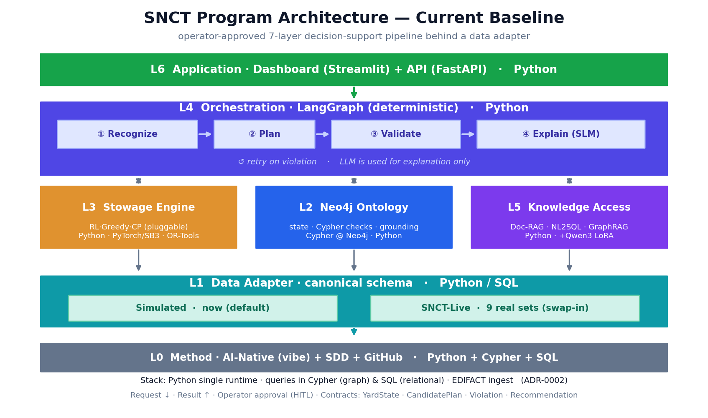

# 아키텍처 기준도 (현재 확정본)

프로그램 단일 기준도 — 모든 결정(데이터 어댑터·교체가능 엔진·결정론적 오케스트레이션·계약·HITL)을 한 장으로.

- **L6 App**: Streamlit 대시보드 + FastAPI
- **L4 Orchestration**: LangGraph 결정론적 (recognize→plan→validate→explain, 위반 시 재시도, LLM은 설명만)
- **L3 Engine**: StowageStrategy — RL(원우 재사용·기본)·Greedy(폴백)·CP(향후) · ADR-0001
- **L2 Ontology**: Neo4j 상태 표현·Cypher 검증·LLM 근거(grounding)
- **L5 Knowledge Access**: 문서RAG · NL2SQL · GraphRAG(text2Cypher) + 융합(xAI) + Qwen3 LoRA (specs/07)
- **L1 Data Adapter**: Simulated(현재) / Live(실데이터 9종 — specs/06)
- **L0 Method**: AI-Native(바이브) + SDD + GitHub flow
- **구현 언어**: Python 단일 런타임 · 질의=Cypher/SQL · 입력=EDIFACT (ADR-0002)
- **계약(작업 경계)**: YardState · CandidatePlan · Violation · Recommendation
- **흐름**: 요청 ↓ 통과 · 결과 ↑ 반환 · 운영자 승인(HITL) · 설명은 엔진/온톨로지/RAG 사실에 근거
