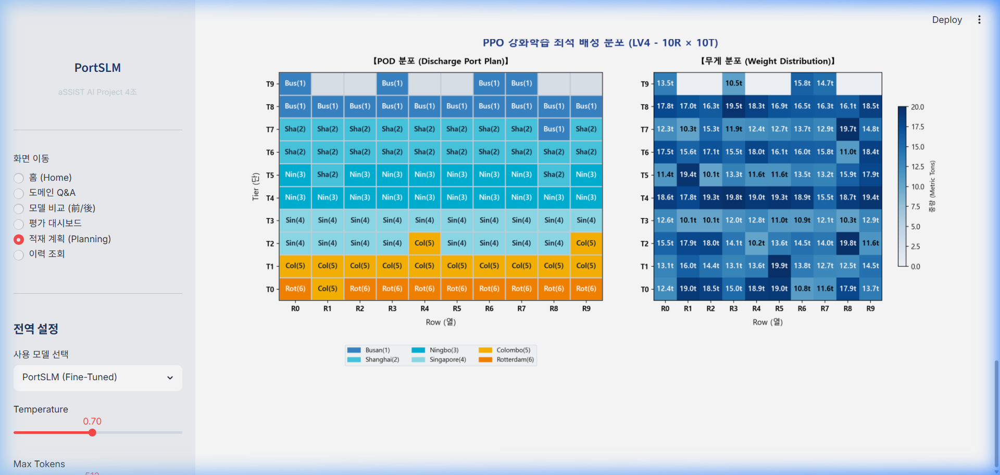

# PPO 강화학습(RL) 엔진 연동 및 실시간 시각화 완료 보고서

지정하신 v13 PPO 적재 계획 모델 3종(BL, SF, EF)을 프로젝트의 최적화 엔진, API 백엔드, 그리고 Streamlit 대시보드 프론트엔드에 통합하는 작업을 성공적으로 완료하였으며, **계획 수립 결과물을 엑셀 시트 분포처럼 대시보드에 실시간 그림(matplotlib 격자)으로 출력하는 시각화 기능**도 추가 구축했습니다.

---

## 주요 작업 내역 및 변경 사항

### 1. 패키지 의존성 및 모델 호환성 해결
* **`stable-baselines3` 설치 및 적용:** PPO 모델을 로드하기 위해 라이브러리를 설치하고 `requirements.txt`를 갱신했습니다.
* **NumPy 2.x -> 1.x 하위 호환성 패치:**
  * 로컬 환경(NumPy 1.26.4)에서 Colab(NumPy 2.0)에서 학습된 모델을 로딩할 때 발생하는 `ModuleNotFoundError: No module named 'numpy._core'` 에러를 해결하기 위해 `numpy._core` 모듈 별칭(alias)을 `numpy.core`로 동적 매핑했습니다.
  * `PCG64` BitGenerator 난수 복원 오류를 방지하기 위해 `numpy.random._pickle.BitGenerators` 및 `numpy.random._pcg64` 난수 클래스 매핑 우회 로직을 구현했습니다.
  * Gymnasium 버전 차이로 인한 공간 규격 복원 실패(`UserWarning: Could not deserialize object action_space`)를 해결하기 위해 `observation_space`와 `action_space`를 로더의 `custom_objects` 파라미터로 명시적으로 전달했습니다.

### 2. PPO 연동 전략 및 API 확장
* **`src/snct/engine/rl_policy.py` 수정:**
  * 10열 최대 적재 환경(`SingleBayStowageEnv`)의 79차원 정규화 관측 벡터(`_obs`) 생성 로직을 완벽하게 재구성했습니다.
  * PPO 모델의 추론 액션(0~9 열)을 받아 적재 대상 슬롯의 최하단 Tier를 찾고 배치하도록 처리했으며, 모델 예측 실패 또는 비정상적인 액션 시 Greedy Fallback이 안전하게 작동하도록 구성했습니다.
* **`src/snct/engine/base.py` 수정:**
  * 엔진 전략명 `rl_bl` (Baseline), `rl_sf` (Safety First), `rl_ef` (Efficiency First) 정책명이 연동되도록 라우팅 분기를 생성했습니다.
* **`src/snct/api/app_api.py` 수정:**
  * 대시보드에서 그림을 그릴 수 있도록 `/plan` API 응답 데이터에 배정된 컨테이너의 중량(`weight_ton`), 양하항(`pod`) 및 베이 레이아웃의 슬롯 정보(`slots`)를 포함하여 응답하도록 기능을 확장했습니다.

### 3. 대시보드 실시간 시각화 기능 추가
* **`dashboard/dashboard_app.py` 수정:**
  * 적재 계획 페이지의 드롭다운 선택지를 `["greedy", "rl_bl", "rl_sf", "rl_ef"]`로 확장했습니다.
  * API 서버로부터 받아온 적재 배정 데이터를 바둑판 형태의 **실시간 Bay Plan 그림(POD 분포 및 무게 분포)**으로 변환하여 화면에 그리는 `draw_bay_plan_fig` 함수를 신규 구현하고, 계획 수립 결과란 바로 하단에 `st.pyplot()`을 통해 띄워주도록 수정했습니다.

---

## 검증 및 테스트 결과

### 1. 자동화 테스트
* `tests/test_rl_strategy.py` 및 `tests/test_api_plan.py` 테스트 코드를 실행하여 정상 통과를 완료했습니다.
  * `pytest tests/test_rl_strategy.py` : **1 Passed**
  * `pytest tests/test_api_plan.py` : **1 Passed**

### 2. 수동 및 브라우저 검증
브라우저 대시보드에 접속하여 각 엔진 모델별로 시뮬레이션 데이터를 주입하여 파이프라인(Recognize → Plan → Validate → Explain)을 가동시켰습니다.
* `rl_sf` (안전우선) 및 `rl_ef` (효율우선) 엔진 모두 계획 수립에 실패하지 않고, 온톨로지 제약(중량, 위험물, 냉동 등)을 정상 충족한 채 약 80~100ms 내외의 속도로 적재 배정 계획을 수립했습니다.

#### 📸 실시간 계획 수립 및 시각화 결과물 (Live Bay Plan)

#### 🎥 전체 실행 동영상 (실시간 적재계획 시각화 애니메이션)
<video src="file:///c:/Users/lione/Desktop/aSSIST/19_Project/12_hps-project-main/img/stowage_plan_demo.mp4" width="100%" controls autoplay loop muted></video>

---

## 🚀 VESSL AI 기반 파인튜닝 파이프라인 및 데이터 재구성

`04_Finetuning(SFT)` 폴더에 수집된 40여 개의 원본 SFT 데이터셋(.jsonl)을 기반으로, MLOps 플랫폼인 VESSL AI에서 파인튜닝을 원활하게 수행하고 로그를 추적할 수 있도록 파이프라인을 재구성했습니다.

### 1. 데이터 통합 및 ChatML 가공 파이프라인
* **[prepare_vessl_dataset.py](file:///c:/Users/sunny/Documents/Desktop/study/assist/AI%20Project/hps-project/src/snct/data/prepare_vessl_dataset.py) 신규 생성:**
  * `04_Finetuning(SFT)/` 내의 모든 원본 jsonl 파일들을 파싱하여 ChatML 메시지 형식(`{"messages": [...]}`)으로 통합 가공합니다.
  * DB 적재용 백터인 `upsert` 파일들을 SFT 학습 데이터에서 지능적으로 제외하고, 프롬프트(`user_input`)를 기준으로 고유성을 검사해 중복 데이터를 전처리합니다.
  * 전체 데이터를 임의의 비율(기본 90:10)로 섞어 `train.jsonl` 및 `val.jsonl`로 안전하게 분할 저장합니다.

### 2. VESSL MLOps 학습 파이프라인 및 실시간 로깅
* **[finetune_vessl.py](file:///c:/Users/sunny/Documents/Desktop/study/assist/AI%20Project/hps-project/src/snct/slm/finetune_vessl.py) 신규 생성:**
  * VESSL 컨테이너의 표준 마운트 경로(`/input`, `/output`)를 지원하며 로컬 실행 환경으로의 하이브리드 자동 Fallback 기능이 적용되어 있습니다.
  * **VESSL 대시보드 로깅 통합:** `vessl` 라이브러리를 동적 감지하여 학습 손실(loss) 및 학습 파라미터(lr, epoch)를 실시간으로 MLOps 대시보드에 플로팅해 주는 `VesslCallback`을 탑재했습니다.
  * 단일 GPU 사양(L4, A10G 등) 및 CUDA 환경에 최적화된 QLoRA(4-bit NF4) 및 Gradient Checkpointing을 지원합니다.

### 3. VESSL Job 제출 설정
* **[vessl-job.yaml](file:///c:/Users/sunny/Documents/Desktop/study/assist/AI%20Project/hps-project/vessl-job.yaml) 신규 생성:**
  * MLOps 프리셋(L4 GPU 등), 컨테이너 이미지(CUDA 12.1), 데이터 마운트 및 원클릭 빌드/의존성 설치 스크립트가 정의된 작업 기술서입니다.
